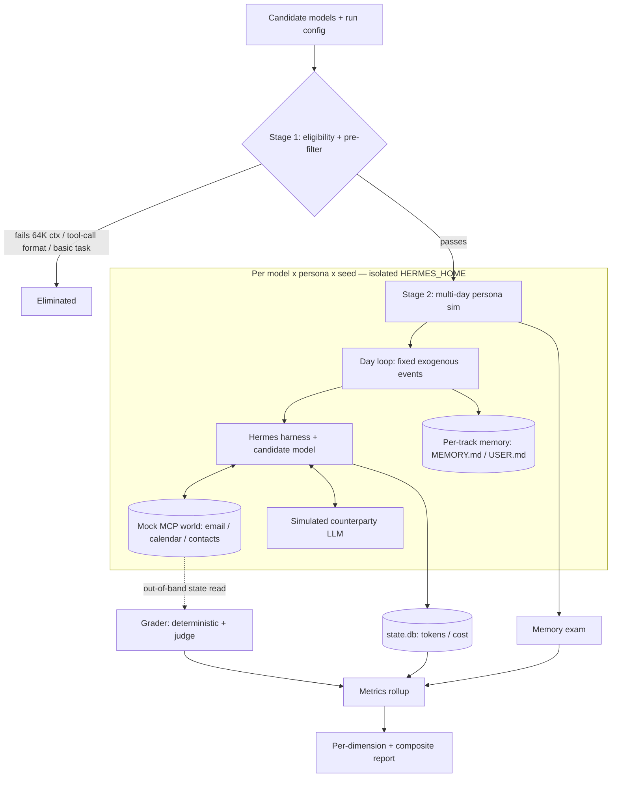

# feat: Hermes model-simulator

## Summary

Build a Python benchmark harness that runs candidate open-weight models inside the fixed Nous `hermes-agent` harness and ranks them for the personal-assistant business on capability and true cost. A cheap Stage-1 pre-filter eliminates ineligible/weak models; survivors run a multi-day, memory-on simulation of one synthetic person's interlinked life (email, calendar, kids' activities, spouse coordination) built from mock MCP servers, graded by a deterministic + LLM-judge hybrid, and scored on capability, memory quality, reliability (pass^k), and cost.

---

## Problem Frame

The business cannot be founded on a frontier subscription whose access or pricing may change, so the model running each client's assistant must be an open-weight model the operator can self-host or rent from any provider (see origin: docs/brainstorms/2026-06-28-hermes-model-simulator-requirements.md). "Which open model is good enough, and what does it really cost to complete real tasks?" is unanswerable from published benchmarks or per-token sticker prices — a cheap model that triples token use, fails one run in three, or forgets the user is not viable for running someone's life. The spike (`docs/spikes/2026-06-28-hermes-feasibility-findings.md`) proved the harness can be driven for this: headless runs, per-run token/cost in `state.db`, isolated per-track memory, and a mock world via custom MCP servers. This plan builds the simulator on that foundation.

---

## High-Level Technical Design

One agent harness is held constant; the model is the variable. Each `(model × persona × seed)` runs in its own `HERMES_HOME` so memory tracks never cross. A fixed exogenous event stream feeds every track identically; only the agent's own state diverges. The grader reads world state **out-of-band** (directly from each mock server's backing store), never through an agent-reachable tool — closing the reward-hack / answer-leak hole documented for callable graders.



---

## Output Structure

```text
hermes-simulator/
  pyproject.toml
  simulator/
    config.py              # candidate models, hosting profiles, run config (seeds, k, weights)
    harness.py             # wraps hermes CLI: HERMES_HOME setup, model/provider, memory reset
    runner.py              # orchestrator over (model x persona/scenario x seed); two-stage funnel
    world/
      state.py             # backing store for the mock world; out-of-band inspection API
      email_server.py      # mock MCP server (stdio, FastMCP)
      calendar_server.py   # mock MCP server
      contacts_server.py   # mock MCP server
    counterparty.py        # simulated spouse/school/kids LLM (partial observability)
    scenarios/
      stage1/              # single-shot cross-domain tasks + expected end-states
      personas/
        <persona>/         # event stream, preference reveals, answer key
    grading/
      deterministic.py     # state-diff assertions (isolated process)
      judge.py             # frontier LLM-as-judge, rubric-anchored
      memory_exam.py       # memory probes: recall / update / abstention (forgetting-aware)
      behavioral.py        # improvement-over-days checks
    metrics.py             # state.db queries, pass^k, cost normalization
    report.py              # per-dimension + composite, ranked side-by-side
  tests/
  results/                 # trajectories + run outputs (gitignored)
```

---

## Key Technical Decisions

- KTD1. **Hermes is a fixed input; one `HERMES_HOME` per track.** The harness is never modified or benchmarked; isolation, headless runs, token/cost capture, and memory reset all use mechanisms proven in the spike.
- KTD2. **Mock world as MCP servers with out-of-band ground truth.** Email/calendar/contacts are FastMCP stdio servers over a shared backing store (`world/state.py`). The grader reads that store directly; ground truth is never exposed as a callable tool or readable file inside the agent's environment (mitigates reward-hacking — METR — and gold-answer leakage — WebArena).
- KTD3. **Two-stage funnel with hard eligibility gates.** Stage 1 drops any model below 64K context or that fails to emit Hermes's tool-call format (both observed in the spike: `qwen3:8b` rejected at 40K; `gemma3:12b` produced no usable final response), plus a few single-shot cross-domain tasks. Only survivors enter the expensive Stage-2 simulation.
- KTD4. **Hybrid grading; frontier judge from a different family.** Deterministic state-diff decides crisp success/fail; an LLM judge scores only qualitative dimensions (tone, proactivity, surfacing remembered context). The judge is a frontier API model (user-approved; the eval-pipeline frontier dependency is acceptable) chosen from a different family than the models under test, rubric-anchored, with optional 3-judge majority to curb position/verbosity/self-preference bias.
- KTD5. **Memory tested two ways, graded by outcome.** An end-of-run exam probes recall, **knowledge-update** (a preference that changed mid-run), and **abstention** (events that never happened), scored forgetting-aware (stale answers penalized, not only missing ones). Separately, behavioral-improvement-over-days checks whether the agent stops repeating corrected mistakes. How the model "remembers" (weights, skills, log search) is irrelevant.
- KTD6. **Reliability via pass^k.** `pass^k = E_task[ p_task^k ]` (probability all k i.i.d. runs of a task succeed), default k=5 over fixed seeds. The exogenous event stream is identical across tracks so seed variance reflects the model, not the world.
- KTD7. **Cost normalization: tokens always, dollars made comparable.** Always report tokens-to-complete (incl. cache and reasoning tokens) and latency from `state.db`. For API models use `state.db` cost; for self-hosted, derive a comparable dollar figure from a configurable price-per-1M-token assumption. Report every dimension separately **and** a configurable weighted composite.
- KTD8. **Python stack; drive Hermes per spike recipe.** Python matches `hermes-agent` and the MCP SDK already in its venv. Single-shot tasks use `hermes -z`; multi-day runs persist memory across day-invocations in the same `HERMES_HOME`. The per-run plugin-discovery cold-start tax (spike finding) is a perf concern handled in U3, not a correctness one.

---

## Requirements

**Mock world and runner**
- R1. The mock world (email, calendar, contacts) runs as MCP servers over a seeded backing store with an out-of-band inspection API; ground truth is unreachable by the agent. (origin R1)
- R2. A fixed, timestamped exogenous event stream is applied identically across every model's track. (origin R2)
- R3. Each `(model × persona × seed)` runs in an isolated `HERMES_HOME` with memory reset between tracks; no memory crosses tracks. (origin R6)
- R4. The runner drives the Hermes harness headlessly per track and captures the transcript plus per-run `state.db` metrics. (origin R5, R7)
- R5. Stage 1 enforces eligibility gates (≥64K context; tool-call-format compatibility) and a single-shot pre-filter before Stage 2. (origin R5)

**Personas and counterparty**
- R6. Each persona is a curriculum: learnable regularities and early preference reveals — including one preference that changes and one abstention trap — with a ground-truth answer key. (origin R3)
- R7. Simulated counterparties (spouse/school/kids) respond consistently from a per-persona script via a cheap fixed model with partial observability. (origin R4)

**Grading and metrics**
- R8. Grading is hybrid — deterministic state-diff for crisp outcomes, LLM-judge for fuzzy behavior — with the grader running out-of-band from the agent. (origin R8)
- R9. A memory exam scores recall, knowledge-update, and abstention against ground truth, forgetting-aware. (origin R9)
- R10. Behavioral improvement over days is measured, distinct from the final exam. (origin R10)
- R11. Cost is reported as tokens-to-complete (incl. cache/reasoning) combined with price, plus latency, comparable across local and API models. (origin R11)
- R12. Reliability is reported as pass^k across repeated seeds. (origin R12)
- R13. The harness can target both self-hosted and API-hosted open models via config, making hosting strategy an output. (origin R13)
- R14. The report is a ranked, side-by-side per-model comparison across capability, memory, reliability, and cost — each dimension separately and as a configurable weighted composite. (origin R14)

---

## Implementation Units

### Phase 1 — Foundation

### U1. Project scaffold, config, and Hermes harness wrapper
- **Goal:** Stand up the Python package and a wrapper that runs the Hermes harness against a chosen model in an isolated, disposable `HERMES_HOME`.
- **Requirements:** R3, R4, R13
- **Dependencies:** none
- **Files:** `pyproject.toml`, `simulator/config.py`, `simulator/harness.py`, `tests/test_harness.py`
- **Approach:** `config.py` declares candidate models (id, provider, base_url, context_length), hosting profiles (local Ollama vs API), and run params (seeds, k, composite weights). `harness.py` creates a fresh `HERMES_HOME`, seeds minimal `config.yaml` (provider/model/base_url), runs `hermes -z` with `HERMES_ACCEPT_HOOKS=1`, returns stdout + exit code, and exposes `reset_memory()` (`hermes memory reset`) and a `state.db` reader. Encapsulates the spike recipe so nothing else shells out to `hermes` directly.
- **Patterns to follow:** spike commands in `docs/spikes/2026-06-28-hermes-feasibility-findings.md` (Q1–Q3 reproduce blocks).
- **Test scenarios:**
  - Happy path: a one-shot prompt against a configured local model returns clean stdout and exit 0.
  - Edge: a model below 64K context surfaces the harness's context-window error as a typed, catchable result rather than a raw crash.
  - Isolation: two harness instances with different `HERMES_HOME`s do not share memory files.
  - `reset_memory()` empties `memories/USER.md` for that home only.
- **Verification:** a candidate model can be run end-to-end and its tokens/cost read back from `state.db`.

### U2. Mock world MCP servers + out-of-band state store
- **Goal:** Implement the fake email/calendar/contacts world as MCP servers the agent calls, with a backing store the grader inspects directly.
- **Requirements:** R1
- **Dependencies:** U1
- **Files:** `simulator/world/state.py`, `simulator/world/email_server.py`, `simulator/world/calendar_server.py`, `simulator/world/contacts_server.py`, `tests/test_world.py`
- **Approach:** `state.py` is the single backing store (SQLite or JSON) holding inbox, calendar, contacts, plus an `inspect()` API used only by the grader/runner — never registered as a tool. Each server (FastMCP stdio, per the spike's `mock_calendar_mcp.py`) exposes realistic tools (`list_emails`, `send_email`, `create_event`, `find_conflicts`, `get_contact`, …) that read/write the store. Servers are registered into a track's `HERMES_HOME` via `hermes mcp add` (auto-confirm enable).
- **Patterns to follow:** spike `mock_calendar_mcp.py`; `hermes mcp add --command <venv-python> --args <server>`.
- **Test scenarios:**
  - Happy path: an agent run that calls `create_event` lands the event in the store; `inspect()` returns it.
  - Covers AE1. Two tracks acting differently on day 1 leave divergent store state but both still receive the identical scripted events.
  - Edge: `create_event` onto an occupied slot is representable so conflict-detection tasks have ground truth.
  - Isolation/security: the ground-truth answer key is not reachable through any registered tool or any file under the agent's `HERMES_HOME`.
- **Verification:** the agent can operate the world through tools while the grader reads end-state out-of-band.

### U3. Run orchestrator and two-stage funnel
- **Goal:** Drive the full matrix of `(model × scenario/persona × seed)` through Stage 1 then Stage 2, capturing transcripts and metrics.
- **Requirements:** R2, R4, R5
- **Dependencies:** U1, U2
- **Files:** `simulator/runner.py`, `tests/test_runner.py`
- **Approach:** For each candidate model, run Stage-1 eligibility gates (context check, tool-call-format smoke task) and the pre-filter task set; drop failures with a logged reason (no silent caps). Survivors enter Stage 2: a day loop replays the persona's fixed exogenous event stream into the world, invokes the harness per day in the same `HERMES_HOME` (memory persists across days), and runs the counterparty turns. Persist trajectories under `results/`. Mitigate the cold-start plugin-discovery tax (spike finding) — persistent gateway process or trimmed toolsets; final mechanism chosen at implementation.
- **Patterns to follow:** tau-bench run loop (separate user-sim turns; store all trajectories) — see Sources.
- **Test scenarios:**
  - Happy path: a 2-day mini-persona runs to completion for one model and writes a trajectory + metrics row.
  - Gate: a model failing the tool-call-format smoke task is eliminated before Stage 2 and the reason is recorded.
  - Covers AE1. The same seed replays an identical event stream regardless of agent actions.
  - Reliability: the same `(model × persona)` runs k seeds, each in a fresh track.
  - Error path: a harness failure on one day is captured and the track is marked failed without aborting the whole matrix.
- **Verification:** a full small matrix produces per-track trajectories and a metrics table.

### Phase 2 — Content

### U4. Stage-1 pre-filter task suite
- **Goal:** A small set of single-shot, memory-off cross-domain tasks with deterministic end-states that cheaply separate viable models from non-viable ones.
- **Requirements:** R5, R8
- **Dependencies:** U2, U3
- **Files:** `simulator/scenarios/stage1/` (task definitions + expected end-states), `tests/test_stage1.py`
- **Approach:** ~10–20 tasks, each = seeded world slice + trigger + expected state-diff (tau-bench-style key-value assertions), spanning email→calendar→coordination seams. Authored to be crisp enough for deterministic grading.
- **Patterns to follow:** WebArena per-task grader registry (each task names its verifier); tau-bench DB-diff.
- **Test scenarios:**
  - Each task's expected end-state is reachable by a correct trajectory and rejected for a wrong one (fixture-level, no live model).
  - Covers AE? A conflict-detection task fails a model that silently double-books.
  - A task suite run yields a per-model pass/fail vector.
- **Verification:** running the suite against one known-good model passes; against a deliberately broken stub, fails the right tasks.

### U5. Persona format + first persona (curriculum)
- **Goal:** Author one rich multi-day persona whose structure actually exercises memory.
- **Requirements:** R2, R6
- **Dependencies:** U2
- **Files:** `simulator/scenarios/personas/<persona>/` (event stream, preference reveals, answer key), `simulator/scenarios/personas/schema.py`, `tests/test_persona.py`
- **Approach:** A schema for a timestamped exogenous event stream + a ground-truth answer key. The first persona plants learnable regularities (e.g., recurring Thursday soccer), early preference reveals (e.g., no meetings before 9am), **one preference that changes mid-run** (a regularity moves), and **one abstention trap** (a plausible event that never happens). The answer key drives both the memory exam (U8) and behavioral checks (U7).
- **Patterns to follow:** LongMemEval ability taxonomy (extraction, multi-session reasoning, temporal, knowledge-update, abstention); Memora/FAMA mutation tracking — see Sources.
- **Test scenarios:**
  - Schema validation: a persona with a malformed event stream or missing answer-key entry is rejected.
  - The persona contains at least one knowledge-update and one abstention item, asserted structurally.
  - The event stream is deterministic given a seed.
  - `Test expectation:` content authoring is data, but the schema/loader is feature-bearing and carries the above.
- **Verification:** the persona loads, replays deterministically, and its answer key resolves every exam probe.

### U6. Simulated counterparty agent
- **Goal:** A consistent spouse/school/kids stand-in so multi-day coordination has something to coordinate with.
- **Requirements:** R7
- **Dependencies:** U3, U5
- **Files:** `simulator/counterparty.py`, `tests/test_counterparty.py`
- **Approach:** A cheap fixed LLM prompted from a per-persona counterparty brief with **partial observability** (sees the agent's messages, not its tool calls — per tau-bench). Same counterparty model across all candidate models so it adds equal noise everywhere. Deterministic where possible (seeded, scripted beats for key coordination moments).
- **Patterns to follow:** tau-bench user-simulator (configurable user model, partial observability, scripted goal).
- **Test scenarios:**
  - Happy path: given an agent message asking the spouse to confirm a pickup, the counterparty returns a coherent in-character reply.
  - Consistency: the same seed + same agent message yields the same reply.
  - Partial observability: the counterparty's prompt never includes the agent's tool calls.
- **Verification:** a multi-turn coordination beat completes with in-character, seed-stable counterparty replies.

### Phase 3 — Grading and Reporting

### U7. Deterministic grader + behavioral-improvement checks
- **Goal:** Score crisp outcomes by state-diff and measure whether behavior improves over days — out-of-band from the agent.
- **Requirements:** R8, R10
- **Dependencies:** U2, U4, U5
- **Files:** `simulator/grading/deterministic.py`, `simulator/grading/behavioral.py`, `tests/test_grading_deterministic.py`
- **Approach:** `deterministic.py` compares the world's end-state against a task's expected diff (key-value assertions), running in a process with no imports from the agent's environment. `behavioral.py` checks improvement signals defined in the persona (e.g., a conflict corrected on day 2 is not repeated on day 6) from the trajectory + store history.
- **Patterns to follow:** tau-bench DB-diff; DAGMetric hard-gate-before-judge.
- **Test scenarios:**
  - Happy path: a correct end-state scores pass; a wrong field scores fail with the offending key reported.
  - Covers AE3. A model that surfaces a previously-corrected conflict scores higher on behavioral improvement than one that repeats it.
  - Edge: partial completion (event created but spouse not invited) scores as specified, not silently passed.
  - Security: the grader cannot be influenced by agent-produced content (reads store, not transcript claims).
- **Verification:** deterministic scores are reproducible across re-runs of the same trajectory.

### U8. Memory exam + LLM-as-judge
- **Goal:** Score memory quality and the genuinely fuzzy behavioral dimensions.
- **Requirements:** R6, R9
- **Dependencies:** U1, U5
- **Files:** `simulator/grading/memory_exam.py`, `simulator/grading/judge.py`, `tests/test_memory_exam.py`, `tests/test_judge.py`
- **Approach:** `memory_exam.py` runs end-of-run probes (recall / knowledge-update / abstention) against the persona answer key, scored forgetting-aware (a stale post-change answer is wrong; correct abstention scores). `judge.py` is a frontier API judge from a different family than the models under test, rubric-anchored, order-randomized, with optional 3-judge majority; it scores only qualitative dimensions and returns a structured verdict.
- **Patterns to follow:** LongMemEval / FAMA (forgetting-aware, knowledge-update, abstention); LLM-judge bias mitigations (cross-family, rubric-anchored, position randomization, majority vote) — see Sources.
- **Test scenarios:**
  - Recall: a planted fact is scored correct only when the answer matches the key.
  - Knowledge-update: after a preference changes, the pre-change answer scores wrong and the post-change answer scores correct.
  - Abstention: claiming a never-scheduled event scores wrong; correctly saying "no such event" scores correct.
  - Judge: identical responses in swapped order produce the same verdict (position-bias guard); judge runs against a fixed transcript fixture, not a live model.
  - Judge isolation: the judge model differs in family from the graded model.
- **Verification:** exam and judge produce reproducible scores on fixed fixtures.

### U9. Metrics rollup and comparison report
- **Goal:** Turn per-track results into a ranked, side-by-side model comparison.
- **Requirements:** R11, R12, R14
- **Dependencies:** U3, U7, U8
- **Files:** `simulator/metrics.py`, `simulator/report.py`, `tests/test_metrics.py`, `tests/test_report.py`
- **Approach:** `metrics.py` reads `state.db` per track (input/output/cache/reasoning tokens, cost, latency), computes `pass^k = E_task[p_task^k]` over seeds, and normalizes cost (API dollars from `state.db`; local dollars via configurable price-per-1M assumption). `report.py` emits each dimension separately (capability, memory, reliability, cost) and a configurable weighted composite, ranked per model.
- **Patterns to follow:** tau-bench pass^k reporting; cost from the spike's `sessions` table.
- **Test scenarios:**
  - pass^k: known per-task success vectors produce the expected `E[p^k]` (e.g., uniform p over k reduces to p^k).
  - Cost normalization: a local run with zero `state.db` dollars yields a non-zero derived cost under the configured price; an API run uses `state.db` cost directly.
  - Composite: changing weights reorders the ranking as expected; per-dimension columns remain present regardless of weights.
  - Edge: a model eliminated in Stage 1 appears in the report marked eliminated with its reason, not omitted.
- **Verification:** a full small matrix renders a ranked report with all four dimensions plus composite.

---

## Scope Boundaries

**Deferred for later** (origin)
- Second and third personas — start with one to prove the apparatus discriminates, then add breadth.
- Real integrations (live Gmail/calendars) and any production assistant product.

**Outside this product's identity** (origin)
- This is an evaluation simulator, not the assistant product; it ships nothing to end users.
- It does not benchmark or modify the `hermes-agent` harness. It does not evaluate frontier subscription models *as the business foundation* (a frontier model is used only as the eval judge).

**Deferred to Follow-Up Work**
- A persistent-gateway run mode for throughput, if cold-start overhead proves limiting at scale (U3 ships a working mechanism first).
- 3-judge majority voting is optional in U8; single cross-family judge is the default first cut.

---

## Risks & Dependencies

- **Cold-start cost at scale.** Per-run plugin discovery (~38 plugins, spike) multiplied across model × persona × seed × day can dominate wall-clock. Mitigation in U3; persistent-gateway mode deferred as follow-up.
- **Judge bias and cost.** A frontier judge adds API cost and bias risk; mitigated by cross-family selection, rubric anchoring, order randomization, optional majority vote (U8).
- **Reward hacking / answer leakage.** Frontier models hack callable graders (METR) and exploit answer leaks (WebArena). Mitigated structurally by out-of-band grading and keeping ground truth off the agent-reachable surface (KTD2, U2/U7).
- **Hermes version drift.** Installed harness is ~13k commits behind upstream; pin behavior to the installed `v0.16.0` and re-validate before upgrading.
- **Local hardware ceiling.** 48GB M5 Max bounds local model size; larger candidates route to API hosting (R13).
- **Dependency:** the MCP Python SDK in the Hermes venv (`mcp.server.fastmcp`), Ollama for local models, an API key for the judge and any API-hosted candidates.

---

## Open Questions (deferred to implementation)

- Exact world backing store (SQLite vs JSON) — decide when wiring U2 against real tool round-trips.
- Final multi-day driving mechanism (repeated `-z` vs persistent gateway vs `--continue`) — choose in U3 after measuring cold-start cost.
- Concrete composite weights and the local price-per-1M assumption — set defaults in `config.py`, tune after first real runs.
- Which specific frontier judge model — pick in U8 by current price/quality, constrained to a different family than the candidates.

---

## Sources / Research

- `docs/brainstorms/2026-06-28-hermes-model-simulator-requirements.md` — origin requirements.
- `docs/spikes/2026-06-28-hermes-feasibility-findings.md` — proven runner recipe (headless, `state.db` tokens/cost, `HERMES_HOME` isolation, mock MCP).
- τ-bench / tau2-bench (sierra-research, MIT) — per-task state-diff grading, separate user-simulator with partial observability, `pass^k = E_task[p_task^k]`. https://github.com/sierra-research/tau2-bench , https://arxiv.org/abs/2406.12045
- LongMemEval / LoCoMo / Memora (FAMA) — memory-eval rubric: recall, knowledge-update, abstention; forgetting-aware scoring; 3-judge majority. https://github.com/snap-research/locomo , https://arxiv.org/html/2604.20006v1
- LLM-as-judge bias mitigations (position, verbosity, self-preference, family) — cross-family judge, rubric anchoring, order randomization. https://www.adaline.ai/blog/llm-as-a-judge-reliability-bias
- Reward-hacking / answer-leak threats (METR; WebArena Verified) — motivates out-of-band grading. https://benchmarkingagents.com/agent-benchmarks/
