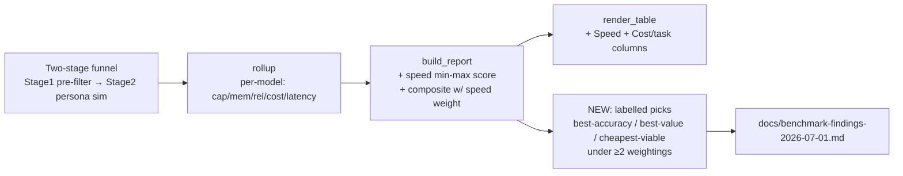

# feat: Amsterdam-family persona + cost-forward, latency-aware model eval

## Summary

Add a PII-scrubbed **Amsterdam-family persona** modelled on the user's real Hermes usage
(multilingual EN/NL/PT; family calendar + email triage + daily briefing; memory recall /
knowledge-update / abstention; heavy-context cost fidelity), expand the OpenRouter model field to
include **Qwen 3.7 Plus** (the user's own, never-benchmarked model) and six peers, add **latency
as a scored composite dimension**, and produce a **per-dimension evidence table with three
labelled picks** (best accuracy / best value / cheapest-viable) under ≥2 weightings — with no
single composite "winner." Then run the field through the existing two-stage funnel at ≥5 seeds
and record the result.

Everything here *extends* existing machinery: a new persona beside `dana`, additive
`CandidateModel` entries, a `speed` field on `CompositeWeights`, and a new picks/weightings
rendering path. No subsystem is reinvented.

---

## Problem Frame

The user stopped using Hermes because their model (**Qwen 3.7 Plus**, `qwen/qwen3.7-plus`) "could
be better" and cost too much — but that model has never been benchmarked here, and the current
field/scoring can't answer their question:

- **No representative persona.** `dana` is synthetic; the real workload is a multilingual family
  assistant doing email triage, daily briefings, and calendar edits (~80% via cron).
- **Scoring under-weights what the user now cares about.** Cost is weighted 0.10, latency isn't
  scored at all, and the real bill is **input-token-dominated** (~77K input vs ~626 output per
  call for Qwen 3.7 Plus) — so a model's *input* price dominates, and the slowest model (Qwen 3.7
  Plus at 15.9s/call vs Gemini's 2.5s) is invisible to the current composite.

See `origin` for the full evidence table and the live-price findings (notably: Gemini 3.5 Flash
is now **$1.50/$9.00** on OpenRouter — the price-drift the recommendation must account for).

---

## Requirements

Traced from the origin requirements doc (R-IDs are the origin's):

- **R1** — New `amsterdam` persona: family calendar, email triage, daily briefing, memory
  mechanics (recall + knowledge-update + abstention), PII scrubbed to `*.test`. → U1
- **R2** — Multilingual dimension (Dutch/Portuguese content, default-language preference,
  translation of a Dutch email). → U1 (two `recall` probes) + U2 (persona-scoped judge rubric)
- **R3** — Heavy-context cost fidelity (large inbox + memory accrual so cost-per-task mirrors the
  real input-dominated bill). → U1
- **R4** — Latency as a scored dimension (`metrics.latency_seconds` exists; not in the
  composite). → U4
- **R5** — Expanded field run via the two-stage funnel; Owl Alpha excluded (unavailable). → U3, U6
- **R6** — Output: per-dimension table (Cap / Mem / Rel / Speed / Cost-per-task) + three labelled
  picks under ≥2 weightings; reconcile with real costs. → U5, U6
- **R7** — Rigor: ≥5 seeds, per-model chunking + stitched report, dated findings. → U6

---

## Key Technical Decisions

- **KTD1 — Latency is its own composite dimension (`speed`), not folded into reliability.**
  `reliability` is `pass^k` (correctness under repetition); latency is orthogonal. Add a `speed`
  weight to `CompositeWeights` and score it by **min-max inversion across survivors** (fastest =
  1.0), mirroring the existing `_cost_scores` exactly (`report.py:53`). Uses mean-per-track
  latency, already computed in `rollup` (`metrics.py:163`). *(Resolves origin open question
  "speed scoring shape.")*

- **KTD2 — Multilingual grading = deterministic backbone + judge nuance.** Two deterministic,
  out-of-band mechanisms, **both using the existing `recall` probe kind** (case-insensitive
  substring match — no schema change, no new behavioral signal kind): a **language-preference
  probe** (target-language keywords) and a **comprehension probe** whose question asks about the
  *content* of the Dutch email (e.g. the appointment it mentions), so a model that fails to parse/
  translate it scores wrong deterministically. On top, a **persona-scoped `multilingual` judge
  rubric dimension** (see KTD7) adds translation-quality nuance. The recall checks are
  gaming-resistant and the judge is never the *sole* comprehension signal. *(Resolves "multilingual
  grading approach." Note: the behavioral grader only supports `no_event_before` / `not_after_day`
  today — it does NOT verify created events, so multilingual comprehension is graded via recall
  probes, not behavioral signals.)*

- **KTD3 — Viability floor gates two of the three picks.** `capability ≥ 0.6 AND memory ≥ 0.5
  AND reliability ≥ 0.75` (module-level tunable constants). **Best-accuracy** ignores the floor
  (pure capability+memory); **best-value** = highest `(capability+memory)/cost_per_task` among
  floor-passers; **cheapest-viable** = lowest cost-per-task among floor-passers. *(Resolves
  "viability quality floor.")*

- **KTD4 — Persona sizing by realistic fidelity, not synthetic padding.** 6 days (dana is 6), a
  realistically large family inbox (~5–8 emails/day, some multi-paragraph Dutch), and natural
  multi-day memory accrual. Cost fidelity emerges from real payload size, not filler. The
  `api-free` $0 smoke validates run cost before any paid run. *(Resolves "persona size vs run
  cost.")*

- **KTD5 — DeepSeek = `deepseek/deepseek-v3.2` committed; `deepseek-v4-flash` optional.** V3.2 is
  the proven tools/general flagship ($0.229/$0.343). V4-flash ($0.098/$0.196, 1M ctx) is listed
  as an optional cheap-input add in Deferred, not run by default. *(Resolves "DeepSeek variant.")*

- **KTD6 — New field name `api-family`, existing `api` field left intact.** Add the expanded
  field as a new `CANDIDATE_FIELDS` entry so the prior 4-model `api` field stays reproducible for
  continuity, and `--candidates api-family` selects the new run. Prices re-verified live
  2026-07-01; the drifted GLM-5.2 sticker in `config.py` ($0.95 → $0.93) is corrected in passing
  because it would mis-cost the run.

- **KTD7 — The `multilingual` judge rubric is persona-scoped, not global.** Adding it to the
  global `DEFAULT_RUBRIC` would score it on `dana` too (the judge runs `DEFAULT_RUBRIC` for every
  track via `pipeline.py:96`), shifting dana's judged capability (`metrics.py:203`) and breaking
  baseline comparability. `Judge` already accepts a `rubric=` argument (`judge.py:172`) and scores
  every dim in `self.rubric` (`judge.py:206`), so U2 plumbs a **persona-selected** rubric through
  `subscription_judge` / `run_full` — `multilingual` applies only to `amsterdam`, `dana` is
  unchanged.

---

## High-Level Technical Design

The change is additive along the existing funnel → rollup → report path. The two new seams are
the `speed` dimension inside the composite and the picks/weightings layer after the report:

Latency (`latency_s`) already flows from `state.db` through `metrics.rollup` to `ModelRollup`; it
is simply not yet carried into `ReportRow` or the composite. U4 closes that gap; U5 adds the picks
layer that reads the rollups.

---

## Implementation Units

### U1. Author the `amsterdam` persona

**Goal:** A PII-scrubbed, multilingual, heavy-context family persona that exercises memory the
same way `dana` does, registered so the runner/graders can select it.

**Requirements:** R1, R2 (recall-probe arm), R3.

**Dependencies:** none (structural); pairs with U2 for the judge arm of multilingual.

**Files:**
- `simulator/scenarios/personas/amsterdam.py` (new)
- `simulator/scenarios/personas/__init__.py` (register in `ALL_PERSONAS`)
- `tests/test_persona.py` (extend) or `tests/test_amsterdam_persona.py` (new)

**Approach:** Mirror `dana.py`'s structure (`Persona`, `DayPlan`, `ExogenousEvent`, `answer_key`
with `memory_probes` + `behavioral_signals`, `counterparty_brief`). Re-theme to a scrubbed
Amsterdam family (e.g. two kids on `*.test` stand-in names; activities: violin/kickboxing/swim/
dance; a dentist appointment; a school). Bake in:
- **Recall:** a standing preference (e.g. default-reply-language = English, stated day 1).
- **Knowledge-update:** a recurring kids' activity that changes day/time mid-run — `expected` =
  new, `stale` = old.
- **Abstention:** a plausible-but-never-scheduled appointment the agent must not invent.
- **Multilingual probes (KTD2):** a `recall` probe for the target-language preference, plus a
  second `recall` probe asking about the *content* of a Dutch inbound email (e.g. the appointment
  it mentions) so comprehension is graded deterministically — both existing `recall` kind, no new
  behavioral signal.
- **Heavy context (KTD4):** ~5–8 emails/day, at least one multi-paragraph Dutch email needing
  translation; 6 days. **Author every email body (Dutch and English) from scratch** to match the
  real cadence/length — do not copy or lightly edit sentences from the source transcript (a real
  address, phone, or name can hide inside body prose, not just a `name` field).
Keep the `validate_persona` invariants: days numbered 1..N, ≥1 knowledge_update and ≥1 abstention
probe, event kinds in `{email,event,contact}`. **PII (blocking):** author every identifier fresh;
no real names, street/house numbers, NL postal codes, phone numbers, email addresses, or exact
institution names — all `*.test`. Do not copy-paste any literal span from the source transcript
(`~/Downloads/hermes_interactions_clean.md`).

**Patterns to follow:** `simulator/scenarios/personas/dana.py` (structure + answer-key shape);
`simulator/scenarios/personas/schema.py` (validity rules).

**Test scenarios:**
- Happy: `validate_persona(AMSTERDAM)` passes (well-formed).
- `replay_events` returns the seeded exogenous stream deterministically (call twice → identical).
- Answer key contains ≥1 each of recall / knowledge_update / abstention (assert kinds present).
- Knowledge-update probe has both `expected` and `stale`; abstention has `trap_keywords`.
- Two multilingual `recall` probes present (language-preference + Dutch-email comprehension), each
  with non-empty `expected`; the referenced Dutch email exists in the day stream with the
  action-bearing content.
- **PII guard:** a test greps `amsterdam.py` against a denylist of literal identifiers derived
  from the source transcript (real names, street/house numbers, NL postal codes, phone numbers,
  email addresses, exact institution names) and asserts **zero** matches. This is the anti-leak
  gate that makes "no committing of real PII" enforceable rather than aspirational.
- Registry: `get_persona("amsterdam")` returns it; `ALL_PERSONAS` includes it.

**Verification:** `pytest tests/test_persona.py -k amsterdam` (or the new test) passes including the
PII-guard test; the persona loads through the same path `dana` does.

---

### U2. Add a persona-scoped `multilingual` judge rubric dimension

**Goal:** Let the LLM-judge score translation/multilingual handling qualitatively for `amsterdam`
only, feeding the capability blend — without changing how `dana` is judged.

**Requirements:** R2 (judge arm). **KTD7.**

**Dependencies:** U1 (a persona with multilingual content to score); the judge changes can be
built in parallel and tested with a stubbed `chat_fn`.

**Files:**
- `simulator/grading/judge.py` (define a `MULTILINGUAL_RUBRIC = {**DEFAULT_RUBRIC, "multilingual": …}`;
  leave `DEFAULT_RUBRIC` untouched)
- `simulator/pipeline.py` and/or `simulator/runner.py` (`run_full`: select the rubric per persona)
- `simulator/__main__.py` (`subscription_judge(...)` — pass the persona-selected rubric)
- `tests/test_judge.py`, `tests/test_pipeline.py` (extend)

**Approach:** Do **not** extend the global `DEFAULT_RUBRIC` — the judge runs it for every track of
every persona (`pipeline.py:96`), so a global change would score a `multilingual` dimension on
monolingual `dana` transcripts and shift dana's judged capability, breaking baseline comparability
(KTD7). Instead define a separate `MULTILINGUAL_RUBRIC` (DEFAULT_RUBRIC + a `multilingual`
dimension: 1 = ignores/garbles the requested language or leaves Dutch untranslated; 5 = accurate
translation and responds in the requested language) and **plumb a persona-selected rubric** into
the judge: `run_full` picks `MULTILINGUAL_RUBRIC` for `amsterdam` and `DEFAULT_RUBRIC` otherwise,
passing it to `Judge(rubric=…)`. `Judge` already accepts `rubric=` (`judge.py:172`) and scores
every dim in `self.rubric` (`judge.py:206`), so no judge-core change is needed — the plumbing is
the work. Keep the cross-family guard untouched.

**Patterns to follow:** existing `DEFAULT_RUBRIC` entries and rubric-anchored scoring in
`judge.py`; the `rubric=` parameter already on `Judge`.

**Test scenarios:**
- Happy: with a stubbed `chat_fn` returning per-dimension scores including `multilingual`, a judge
  built with `MULTILINGUAL_RUBRIC` parses the verdict and `mean` includes it.
- Rubric surfaces `multilingual` in the prompt sent to `chat_fn` (assert on captured prompt).
- **dana comparability (KTD7):** the rubric selected for a `dana` track is `DEFAULT_RUBRIC` (no
  `multilingual` key) and the rubric for an `amsterdam` track includes it — assert the selection
  logic, and that a dana judge prompt contains no `multilingual` dimension.
- Cross-family guard still raises when judge family == candidate family.

**Verification:** `pytest tests/test_judge.py tests/test_pipeline.py` passes; a manual
`--persona amsterdam` run shows a `multilingual` score in the persisted `judge.json`, and a
`--persona dana` run's `judge.json` does not.

---

### U3. Expand the OpenRouter model field

**Goal:** A new `api-family` candidate field containing Qwen 3.7 Plus + six peers with live-
verified prices and tool support; existing `api` field untouched for continuity.

**Requirements:** R5.

**Dependencies:** none.

**Files:**
- `simulator/config.py` (add `CandidateModel`s + `API_FAMILY_CANDIDATES` + `CANDIDATE_FIELDS`
  entry; correct GLM-5.2 price)
- `scripts/build_report.py` (make `_model_for` recognize the new field — see Rebuild-path fix)
- `tests/test_config.py` and a `scripts/build_report.py` rebuild test (extend/create)

**Approach:** Add a new tuple `API_FAMILY_CANDIDATES` (mirror `API_CANDIDATES` entry shape:
`hosting_profile=OPENROUTER`, `context_length=65_536` for apples-to-apples, live prices,
`family=...`). Register under `CANDIDATE_FIELDS["api-family"]`. Members (prices live-verified
2026-07-01, $/1M in/out):

| id | in | out | family |
|---|---|---|---|
| `qwen/qwen3.7-plus` | 0.32 | 1.28 | qwen |
| `qwen/qwen-plus` | 0.26 | 0.78 | qwen |
| `openai/gpt-5.4-mini` | 0.75 | 4.50 | openai |
| `google/gemini-3.5-flash` | 1.50 | 9.00 | google |
| `deepseek/deepseek-v3.2` | 0.229 | 0.343 | deepseek |
| `minimax/minimax-m2.5` | 0.12 | 0.48 | minimax |
| `qwen/qwen3.5-flash` | 0.065 | 0.26 | qwen |

Keep the four continuity models (GLM-5.2, Mistral-Large, Llama-3.3, Qwen2.5-72B) in the new field
too (so a single `--candidates api-family` run compares everything). Correct the drifted GLM-5.2
input price `0.95 → 0.93` (KTD6). Add a code comment recording that **Owl Alpha is unavailable on
OpenRouter as of 2026-07-01** (excluded, not failed). Do not hard-code the key; `OPENROUTER`
profile already carries `key_env`. Every new `family` is set explicitly (prefix inference would
produce e.g. `deepseekdeepseek` for `deepseek/deepseek-v3.2`, so the explicit value is required).

**Rebuild-path fix (P1 — the central-deliverable bug):** `scripts/build_report.py:_model_for`
currently searches only `(*DEFAULT_CANDIDATES, *API_CANDIDATES)` and, on an unknown id, falls back
to a synthesized `LOCAL_OLLAMA` candidate (`build_report.py:49-53`). `normalize_cost` then takes
the LOCAL branch and **ignores the metered `actual_cost_usd`**, imputing local $0
(`metrics.py:82-89`). Since U6 stitches the per-model chunk runs *only* via `build_report.py`, all
seven `api-family` models would be silently mis-costed — corrupting cost-per-task, the cost score,
and every pick. **Fix:** refactor `_model_for` to search **all** `CANDIDATE_FIELDS` values (the
future-proof form coherence recommended), or at minimum add `API_FAMILY_CANDIDATES` to the import
block and the search tuple.

**Patterns to follow:** `API_CANDIDATES` block and `CANDIDATE_FIELDS` in `config.py`;
`_model_for` in `scripts/build_report.py`.

**Test scenarios:**
- `run_config_for("api-family")` returns a `RunConfig` whose candidate ids match the table.
- Every `api-family` candidate has `hosting == Hosting.API`, non-zero prices, and
  `meets_context_floor` true.
- `family_name` is correct for each (explicit `family` set; assert `deepseek`/`minimax`/`google`).
- Existing `api` field is unchanged (same 4 ids) — regression guard.
- `run_config_for("bogus")` still raises `ValueError`.
- **Rebuild costing (P1 regression guard):** `_model_for("qwen/qwen3.7-plus")` resolves to the
  API `CandidateModel` (`hosting == API`, real prices), NOT a synthesized local $0 candidate — so
  a rebuilt report costs `api-family` models from metered dollars.

**Verification:** `pytest tests/test_config.py` passes; `python -m simulator --candidates
api-family --help`-style dry selection lists the models; the runner's OpenRouter tool-support
guard (`simulator/openrouter.py`) accepts them.

---

### U4. Add `speed` as a scored composite dimension

**Goal:** Latency counts in the composite and appears as a reported column; fastest scores 1.0.

**Requirements:** R4.

**Dependencies:** none (latency already in `ModelRollup`).

**Files:**
- `simulator/config.py` (`CompositeWeights`: add `speed: float = 0.0`; include it in `normalized()`)
- `simulator/report.py` (`ReportRow.latency_s`; `_speed_scores`; composite sum; `render_table`
  columns)
- `tests/test_report.py`, `tests/test_config.py` (extend)

*(No `scripts/build_report.py` edit for latency: `latency_s` already flows `TrackEvaluation →
rollup → ModelRollup.latency_s`, so once `report.py` carries it into `ReportRow`/`build_report`,
the rebuild path gets it for free. build_report.py is touched in U3 for cost and U5 for picks, not
here.)*

**Approach:** Add `speed: float = 0.0` to `CompositeWeights` and include it in `normalized()`
(now sums 5 terms; keep the positive-sum guard). **Leave the existing default weights unchanged**
(capability 0.35 / memory 0.35 / reliability 0.20 / cost 0.10, speed 0.0) — this satisfies R4
("make speed *available* to the composite") without shifting any existing persona/field ranking,
and makes the back-compat guard actually hold. The speed-and-cost rebalance lives **only** in
U5's named "cost-forward" weighting (KTD-sanctioned by R6's ≥2-weightings requirement), never in
the global default. In `report.py`, add `_speed_scores` as a copy of `_cost_scores` (min-max
invert `latency_s`, degenerate range → all 1.0), add `latency_s` to `ReportRow`, extend the
composite in `build_report` with `w.speed * speed_score`, and add a `Speed` column (and confirm
`Cost$` reads as cost-per-task) in `render_table`.

**Patterns to follow:** `_cost_scores` and the composite construction in `report.py:53-95`;
`CompositeWeights.normalized()` in `config.py:149`.

**Test scenarios:**
- `CompositeWeights.normalized()` sums to 1.0 across all five dimensions; zero-sum still raises.
- **Default back-compat guard:** the *default* `CompositeWeights` (speed 0.0) reproduces the prior
  4-dimension ranking exactly — normalizing (0.35, 0.35, 0.20, 0.10, 0.0) must equal the old
  normalized (0.35, 0.35, 0.20, 0.10). (This is why U4 does not rebalance the default.)
- `_speed_scores`: fastest → 1.0, slowest → 0.0, single/degenerate → all 1.0, empty → `[]`.
- `build_report`: a faster model with otherwise-equal dimensions outranks a slower one under a
  non-zero `speed` weight.
- `render_table` includes a Speed column and the row values line up.
- Rebuilt report (via `build_report.py`) ranks identically to a live one given the same data —
  confirming `latency_s` reaches `ReportRow` through the shared `report.py` path without a
  build_report-specific latency edit.

**Verification:** `pytest tests/test_report.py tests/test_config.py` passes; `render_table` shows
Cap / Mem / Rel / Speed / Cost$ / Composite.

---

### U5. Labelled picks + multi-weighting report

**Goal:** Emit best-accuracy / best-value / cheapest-viable picks against the viability floor, and
render the ranking under ≥2 weightings — the "show all, no single winner" output.

**Requirements:** R6.

**Dependencies:** U4 (speed dimension + report row shape).

**Files:**
- `simulator/report.py` (add `pick_labels(...)` / `VIABILITY_FLOOR` constants + a
  multi-weighting render helper) — or a small `simulator/picks.py` if `report.py` gets crowded
- `scripts/build_report.py` (call the picks + multi-weighting render; print alongside the table)
- `tests/test_report.py` (extend) / `tests/test_picks.py` (new if split)

**Approach:** Add module-level `VIABILITY_FLOOR` constants (KTD3) and a pure function that takes
the ranked rows (cost-per-task = `cost_usd`, since API cost is per-track/per-task) and returns
three labelled picks: best-accuracy (max `capability+memory`, floor ignored), best-value (max
`(capability+memory)/cost_usd` among floor-passers), cheapest-viable (min `cost_usd` among
floor-passers). **Guard `cost_usd == 0`** in best-value — the `api-free` $0 smoke (U6 step 1) and
any metered-$0 track would divide by zero; treat a $0-cost row as ineligible for the value ratio
(or skip it). Handle the empty-floor-passers case (report "none clear the floor").

Add a helper that renders the table under a list of **named** `CompositeWeights`: `memory_heavy`
(the unchanged default — capability 0.35 / memory 0.35 / reliability 0.20 / cost 0.10 / speed 0.0)
and `cost_forward` (raises cost and speed, lowers memory — e.g. capability 0.25 / memory 0.20 /
reliability 0.15 / cost 0.25 / speed 0.15). This named pair is the **only** home for the speed/cost
rebalance (U4 keeps the global default untouched). Wire both the picks and the multi-weighting
render into `build_report.py`'s output and `pipeline.run_full`'s `report.txt`.

**Patterns to follow:** `Report`/`ReportRow` dataclasses and `render_table` in `report.py`.

**Test scenarios:**
- Best-accuracy ignores the floor (a high-cap/high-mem but low-reliability model can win it).
- Best-value and cheapest-viable exclude floor-failers; assert a below-floor model is never
  picked for either.
- Cheapest-viable picks the lowest `cost_usd` among passers; best-value picks the best
  accuracy-per-dollar (construct rows where these differ, and assert they pick different models).
- **Zero-cost guard:** a $0-cost row does not raise in best-value and is not selected via a
  divide-by-zero (assert no exception; the $0 row is excluded from the value ratio).
- Empty case: no model clears the floor → picks report "none" without crashing.
- Multi-weighting render: the same rollups under `memory_heavy` vs `cost_forward` produce
  different top-ranked rows (assert the reorder happens).

**Verification:** `pytest tests/test_report.py` (and/or `tests/test_picks.py`) passes;
`build_report.py <run_id>` prints the table under ≥2 weightings plus the three labelled picks.

---

### U6. Run the field and record findings

**Goal:** Execute the eval end-to-end and produce the dated recommendation.

**Requirements:** R5, R6, R7.

**Dependencies:** U1–U5.

**Files:**
- `docs/benchmark-findings-2026-07-01.md` (new — the dated result)
- `STRATEGY.md` (update the leader line), `CLAUDE.md` (update "Latest benchmark state")

**Execution note:** Ops/run unit, not test-bearing — `Test expectation: none` (its correctness is
the passing suites of U1–U5 plus the run artifacts). Long unattended runs belong on a VPS
(`docs/guides/vps-unattended-run.md`); mind the ~40-min bg-task kill cap and per-model chunking.

**Approach (run procedure):**
1. `$0 smoke`: `.venv/bin/python -m simulator --candidates api-free --seeds 1 --persona amsterdam`
   (validates the pipeline + persona end-to-end at no cost).
2. Per-model chunks into a shared `--run-id`, each ≤ ~40-min session cap:
   `.venv/bin/python -m simulator --candidates api-family --model <id> --seeds 5 --persona
   amsterdam --run-id <run>` (repeat per model; judge on via the `claude -p` subscription).
3. Stitch: `.venv/bin/python scripts/build_report.py <run> results` → judge-corrected combined
   table + picks + multi-weighting.
4. Re-verify live prices immediately before the run (they drift — Gemini moved to $1.50/$9.00);
   update `config.py` if needed.
5. Reconcile the sim's per-task cost *shape* against the user's real aggregate bill (input-
   dominated) — compare shapes, not absolutes.
6. Write `docs/benchmark-findings-2026-07-01.md`: the per-dimension table, the three picks, the
   ranking under both weightings, and the plain recommendation (best accuracy / best value /
   cheapest-viable). Update `STRATEGY.md` + `CLAUDE.md` leader/state lines. Note Owl Alpha
   excluded (unavailable) and that Gemini's cost ranking reflects the new price.

**Verification:** `build_report.py <run>` produces a complete table for all `api-family` survivors
at 5 seeds; the findings doc names the three picks with numbers; `STRATEGY.md`/`CLAUDE.md` updated.

---

## Scope Boundaries

**In scope:** the persona, the field expansion, latency scoring, the picks/weightings output, and
the run + findings.

### Deferred to Follow-Up Work
- `deepseek/deepseek-v4-flash` ($0.098/$0.196, 1M ctx) as an additional cheap-input candidate
  (KTD5) — add only if the first run shows input cost is decisive.
- p50/tail latency (vs mean) as a refinement to the speed score if mean proves misleading.
- Promoting `api-family` to replace `api` once the new field is validated.
- Any change to how cron/automation *sessions* are simulated beyond the persona's day prompts.

### Non-goals
- No single composite "winner" (user chose show-all).
- No replacement of `dana`.
- No gateway/API-track infra changes (done, merged).
- No committing of real PII.

---

## Risks & Dependencies

- **Live-price drift** (high likelihood, material): prices moved between the handoff and now
  (Gemini). *Mitigation:* U6 step 4 re-verifies immediately before the run; the findings doc is
  dated.
- **Run cost/time across ~11 models × 5 seeds × 6 days.** *Mitigation:* the two-stage funnel drops
  non-viable models before Stage 2; per-model chunking fits the session cap; `api-free` smoke
  first.
- **Model availability / tool-support drift** (Owl Alpha already gone). *Mitigation:* the
  `openrouter.py` tool-support guard fails fast; excluded models are surfaced, not silent.
- **Multilingual grading fidelity:** keyword probes can be brittle across phrasings.
  *Mitigation:* two deterministic `recall` probes (language preference + Dutch-email comprehension)
  plus the persona-scoped judge rubric (KTD2/KTD7), so the judge is never the sole comprehension
  signal.
- **Prereqs:** `OPENROUTER_API_KEY` in gitignored `.env` (never printed); `claude` CLI logged in
  for the judge; `hermes` on PATH.

---

## Sources & Research

- Origin requirements: `docs/brainstorms/2026-07-01-family-persona-and-cost-forward-eval-requirements.md`
- Real usage: `~/Downloads/openrouter_activity_2026-07-01.csv` (2,433 calls, $30.21),
  `~/Downloads/hermes_interactions_clean.md` (136 sessions)
- Live OpenRouter `/models` (fetched 2026-07-01) — prices + tool-support in U3 table
- Prior state: `docs/benchmark-findings-2026-06-30.md` (Mistral-Large leads, memory-weighted);
  `docs/solutions/benchmark-design/late-knowledge-update-discriminates-memory.md`
- Code anchors: `simulator/scenarios/personas/dana.py`, `simulator/config.py`,
  `simulator/report.py`, `simulator/metrics.py`, `simulator/grading/judge.py`,
  `scripts/build_report.py`
